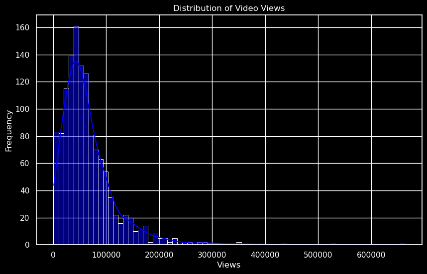
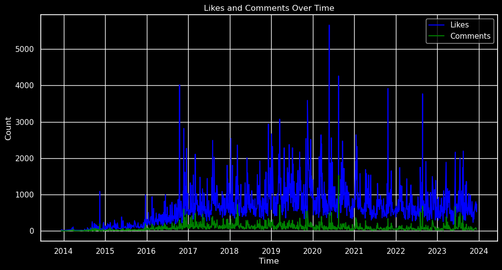
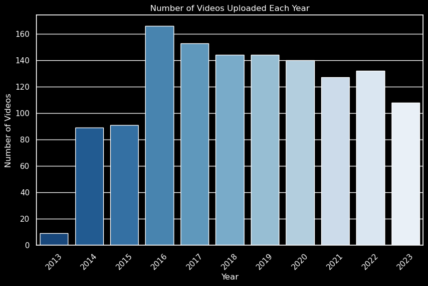
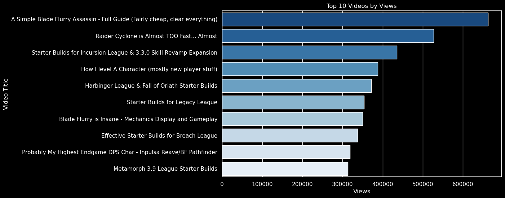
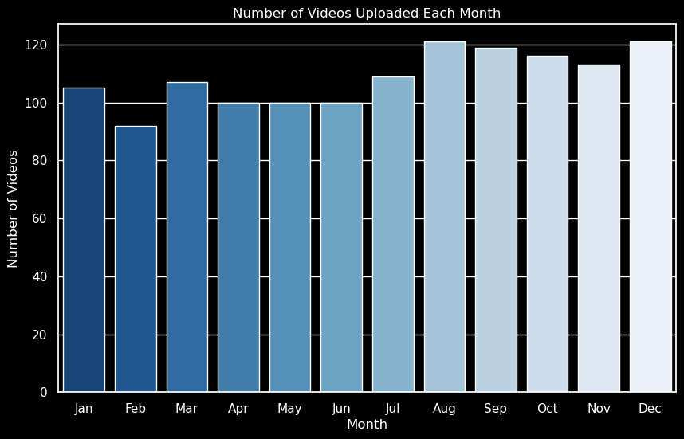
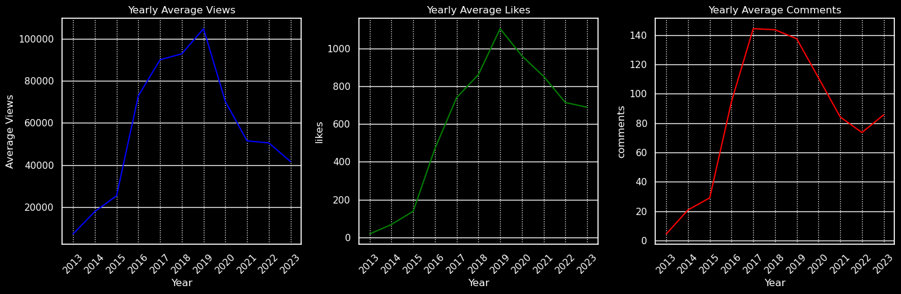

# Mathil YouTube Video Analytics

## Project Goals 🎯

The aim of this project was to harness the capabilities of Python and the YouTube API to:

- **Data Extraction:** Retrieve comprehensive data from the 'Mathilification' YouTube channel.
- **Analysis:** Conduct a thorough analysis of the channel's video statistics.
- **Insights:** Generate insights into performance metrics and viewer engagement.
- **Trends:** Observe and interpret how specific metrics such as view count, subscriber growth, and video uploads are trending over time.

This endeavor seeks to uncover patterns and trends that could inform content strategy and audience growth initiatives.

## YouTube Channel Statistics as of December 12, 2023 🗓️

- **Channel Title:** Mathilification
- **Total Views:** **85,813,468**
- **Subscriber Count:** **171,000**
- **Total Video Count:** **1,304**

These figures represent the channel's status as of this day, reflecting its extensive reach and robust content library.

## Video Views Distribution 📊

**Right-skewed distribution:** Most videos have a view count significantly lower than the average, with a long tail of videos that have very high view counts. This suggests a high variance in video popularity.

## Engagement Trends Over Time 📈🗣️💬

**Fluctuating engagement:** The chart displays a timeline of likes (in blue) and comments (in green) from 2014 to 2023. While likes show notable spikes, suggesting viral hits, comments have a more consistent presence, indicating steady viewer engagement.

Observations indicate that while likes can vary significantly, potentially due to a few highly popular videos, comments remain relatively stable over time, reflecting a core engaged audience.

## Content Production Trends 🎥📆

**Gradual decrease in uploads:** The bar chart shows the number of videos uploaded each year from 2013 to 2023. After peaking in 2016, there's a noticeable downward trend in the number of videos posted annually.

The trend suggests a shift in content strategy, possibly focusing on quality over quantity or changes in resource allocation.

## Top 10 Videos by Popularity 🏆👁️

**Viral content highlights:** This horizontal bar chart showcases the top 10 videos by views, with 'A Simple Blade Flurry Assassin - Full Guide' leading the chart. The visual indicates a strong preference for comprehensive guides and gameplay mechanics among viewers.

The success of these videos suggests that in-depth tutorials and skill demonstrations resonate strongly with the audience, potentially guiding future content creation.

## Monthly Content Upload Patterns 📅📈

**Consistent output with end-of-year surge:** The bar chart illustrates the monthly video upload count, indicating a consistent production rate throughout the year, with a notable increase in November and December.

This pattern may suggest strategic content ramp-up during the year-end, possibly to capitalize on higher viewer availability during the holiday season.

## Yearly Engagement Metrics Trends 📊👀💖💬

**Peaks and Valleys in Engagement:** The trio of line graphs depicts the yearly average views (in blue), likes (in green), and comments (in red) from 2013 to 2023. Each metric peaked at different times, with views peaking in 2018, likes in 2019, and comments in 2020, followed by a general downward trend.

The varying peaks suggest changing audience engagement patterns, possibly influenced by content shifts or platform algorithm changes.

## Final Results and Takeaways 🏁🔍

**Channel Evolution:** Analysis of 'Mathilification' over the past decade has revealed:

- A **right-skewed distribution of video views**, indicating a few videos capture the majority of attention.
- **Engagement trends** show likes correlate with specific content peaks, while comments remain consistently spread out, suggesting a dedicated viewer base.
- A **downward trend in video uploads** since 2016, hinting at a shift in content strategy.
- The **Top 10 videos** are predominantly comprehensive guides, signaling the value of educational content to the audience.
- **Monthly upload patterns** reveal a strategic increase in content towards the year's end.
- **Yearly engagement metrics** indicate varying peaks across views, likes, and comments, reflecting the dynamic nature of viewer interactions.

This data-driven insight could serve as a strategic asset for shaping future content development, optimizing release schedules, and enhancing viewer engagement.

For a complete insight journey, refer to the detailed sections above. 📈💡🎯